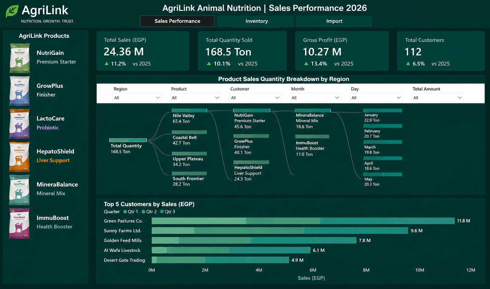
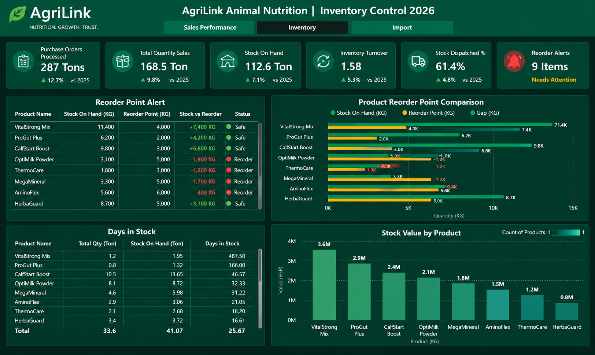
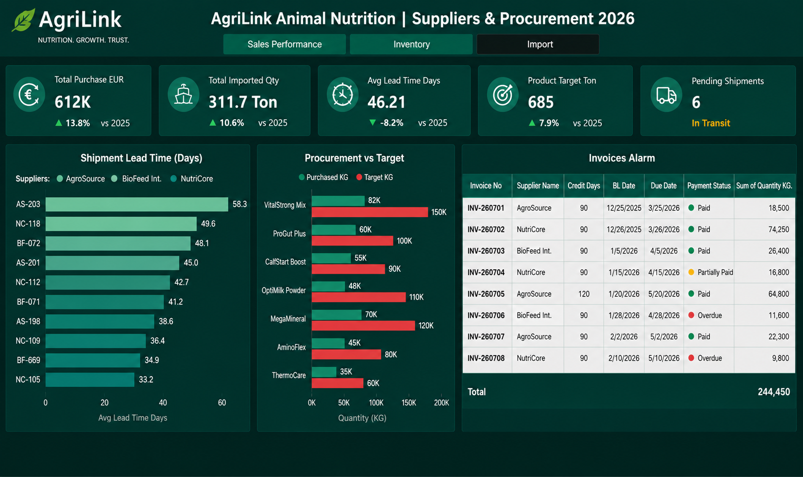

# Sales, Inventory & Supply Chain Analytics Dashboard

## Project Overview

This project is an interactive Power BI dashboard designed to provide a comprehensive view of business performance across Sales, Inventory, and Import & Procurement operations.

The dashboard combines commercial, operational, inventory, and supply chain data into one integrated analytical solution, helping decision-makers monitor performance, identify risks, and support data-driven business decisions.

---

## Dashboard 1 – Sales Performance

The Sales Performance dashboard provides a detailed overview of the company's sales performance during 2026.

### Key Metrics

- Total Sales (EGP)
- Total Quantity Sold (Ton)
- Gross Profit (EGP)
- Total Customers

### Key Analysis

The dashboard allows users to analyze:

- Sales performance by region
- Sales performance by product
- Top customers by sales value
- Monthly sales trends
- Product sales quantity
- Customer contribution to total sales

The product images on the left side are also used as interactive slicers, allowing users to select a specific product and dynamically filter the entire dashboard.

---

## Dashboard 2 – Inventory Control

The Inventory Control dashboard focuses on monitoring stock levels and improving inventory management.

### Key Metrics

- Purchase Orders Processed
- Total Quantity Sales
- Stock on Hand
- Inventory Turnover
- Stock Dispatched %
- Reorder Alerts

### Key Analysis

The dashboard helps monitor:

- Current stock levels
- Reorder Point alerts
- Products that require replenishment
- Stock versus Reorder Point
- Days in Stock
- Inventory Turnover
- Stock Value by Product

The Reorder Point analysis helps identify products approaching critical stock levels, allowing the business to take action and reorder products before stockouts occur.

The Days in Stock analysis also helps evaluate how long products remain in inventory and supports better inventory turnover management.

---

## Dashboard 3 – Import & Procurement

The Import & Procurement dashboard provides visibility into the company's international purchasing and supply chain operations.

### Key Metrics

- Total Purchase Value (EUR)
- Total Imported Quantity
- Average Lead Time
- Product Target Quantity
- Pending Shipments

### Key Analysis

The dashboard provides insights into:

- Shipment Lead Time
- Supplier performance
- Procurement versus Product Targets
- Imported quantities
- Shipment status
- Pending shipments
- Supplier invoices
- Payment status
- Invoice due dates
- Credit periods

The dashboard also compares purchased quantities against product targets to identify the achievement level and remaining quantity required to reach each target.

---

## Business Value

This solution provides a centralized view of Sales, Inventory, and Supply Chain performance.

It helps decision-makers:

- Monitor sales and profitability
- Identify top-performing customers and products
- Detect inventory risks before stockouts occur
- Improve inventory turnover
- Monitor supplier lead times
- Track incoming shipments
- Compare procurement performance against targets
- Monitor supplier invoices and payment due dates
- Support data-driven supply chain decisions

---

## Tools & Technologies

- Power BI
- Data Analysis
- Data Visualization
- Business Intelligence
- Supply Chain Analytics
- Inventory Analytics
- Sales Analytics

---

## Dashboard Preview

### Sales Performance

### Inventory Control

### Import & Procurement

---

## Project Focus

**Data Analytics | Business Intelligence | Supply Chain Analytics | Inventory Management | Sales Performance**
